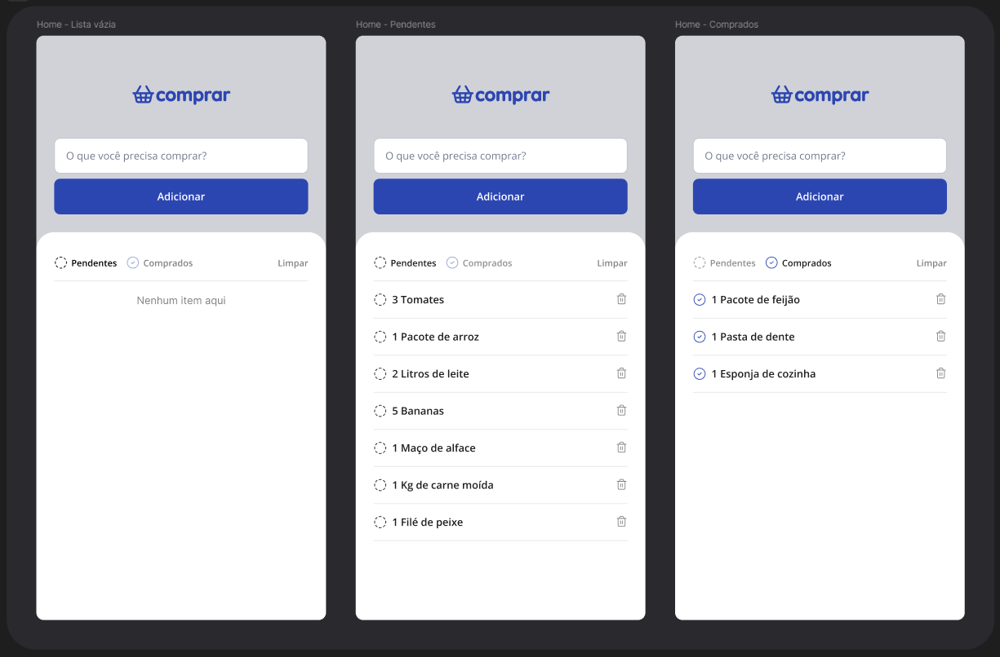

# 🛒 Comprar - Lista de Compras

Aplicativo simples de **lista de compras** desenvolvido com **React Native + Expo**.
O objetivo do projeto é permitir que o usuário registre itens que precisa comprar e acompanhe o status entre **pendentes** e **comprados**.

---

## 📸 Preview da aplicação

---

## 🚀 Tecnologias utilizadas

Este projeto foi desenvolvido utilizando:

* ⚛️ **React Native**
* 🚀 **Expo**
* 🎨 **Lucide React** (ícones)
* 📱 **JavaScript**
* 🧠 **React Hooks**

---

## ✨ Funcionalidades

* ➕ Adicionar itens na lista
* 📋 Visualizar itens **pendentes**
* ✅ Marcar itens como **comprados**
* 🔄 Alternar entre **pendentes** e **comprados**
* 🗑️ Remover itens
* 🧹 Limpar lista